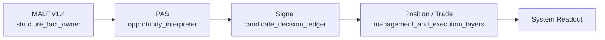

# Malf-Pas 主线权威图 v1

日期：2026-05-15

状态：active / governance-authority-map

## 1. 目标

本文件定义当前主线模块的依赖方向、语义所有权和禁止越界关系。

## 2. 主线图

## 3. 语义所有权

| 模块 | 角色 | 拥有权 |
|---|---|---|
| `MALF v1.4` | 结构事实层 | 拥有波段、transition、boundary、WavePosition 语义 |
| `PAS` | 机会解释层 | 拥有 context、trigger、strength、lifecycle、historical rank 语义 |
| `Signal` | 候选裁决层 | 拥有 accept / reject 决策账本语义 |
| `Position / Trade` | 管理与执行层 | 拥有 T1/T2、保本、跟踪、分批、执行约束 |

## 4. 不变量

1. `MALF v1.4` 只定义结构事实，不输出交易动作。
2. `PAS` 只解释机会，不反向修改 MALF。
3. `Signal` 只裁决候选，不生成成交事实。
4. `Position / Trade` 不能回写上游定义。
5. 外部 adapter 不能取得任一业务模块的语义主权。

## 5. 当前阶段授权

| 项 | 状态 |
|---|---|
| governance-only docs construction | `authorized` |
| PAS axiomatic design | `authorized` |
| runtime implementation | `not authorized` |
| formal DB mutation | `not authorized` |
| broker feasibility | `deferred` |

