# Malf-Pas 主线权威图 v1

日期：2026-05-15

状态：active / governance-authority-map

## 1. 目标

本文件定义当前主线模块的依赖方向、语义所有权和禁止越界关系。

## 2. 主线图

```mermaid
flowchart LR
    A["Data Foundation\nsource fact contract"] --> B["MALF v1.4\nstructure_fact_owner"]
    B --> B2["MALF v1.5\nwave_behavior_snapshot"]
    B2 --> C["PAS\nopportunity_interpreter"]
    C --> D["Signal\ncandidate_decision_ledger"]
    D --> E["Position\nmanagement semantics"]
    E --> F["Portfolio Plan\nlightweight portfolio semantics"]
    F --> G["Trade\nexecution ledger boundary"]
    G --> H["System Readout\naudit readout"]
    I["Pipeline\norchestration ledger"] -. schedules and records .-> A
    I -. schedules and records .-> H
```



## 3. 语义所有权

| 模块 | 角色 | 拥有权 |
|---|---|---|
| `Data Foundation` | 数据事实合同层 | 拥有 source manifest、ledger key、可交易事实、provider adapter 入口边界 |
| `MALF v1.4` | 当前结构事实层 | 拥有波段、transition、boundary、WavePosition 语义 |
| `MALF v1.5` | successor structure behavior fact layer | 已冻结 `wave_behavior_snapshot`，仍由 MALF 拥有结构行为事实 |
| `PAS` | 机会解释层 | 拥有从 MALF WavePosition 出发的 context、trigger、strength / weakness、lifecycle、candidate 语义 |
| `Signal` | 候选裁决层 | 拥有 accept / reject 决策账本语义 |
| `Position` | 持仓管理语义层 | 拥有 T1/T2、保本、跟踪、entry / exit plan 语义 |
| `Portfolio Plan` | 组合计划层 | 拥有组合准入、目标暴露、trim 语义；第一阶段保留轻量层 |
| `Trade` | 执行账本边界层 | 拥有 order intent / fill / rejection 的账本边界；真实 broker 延后 |
| `System Readout` | 系统读出层 | 拥有审计快照、链路读出、回测汇总读出边界 |
| `Pipeline` | 编排账本层 | 拥有 run、checkpoint、manifest 记录；不拥有业务语义 |

## 4. 不变量

1. `Data Foundation` 自建数据合同与可交易事实边界，外部 provider 只能提供 adapter 输入。
2. `MALF v1.4` 只定义结构事实，不输出交易动作。
3. `MALF v1.5` 只能发布结构行为事实，不得替 PAS 做机会解释。
4. `PAS` 只解释机会，不反向修改 MALF。
5. `Signal` 只裁决候选，不生成成交事实。
6. `Position / Portfolio Plan / Trade` 不能回写上游定义。
7. `Pipeline` 只调度和记录，不定义业务模块语义。
8. 外部 adapter 不能取得任一业务模块的语义主权。

## 5. 当前阶段授权

| 项 | 状态 |
|---|---|
| governance-only docs construction | `authorized` |
| PAS axiomatic design | `authorized` |
| MALF v1.5 successor design set | `frozen` |
| PAS v1.2 design revision | `authorized as roadmap-governed docs only` |
| runtime implementation | `not authorized` |
| formal DB mutation | `not authorized` |
| broker feasibility | `deferred` |

## 6. 第三卡冻结入口

`system-mainline-module-ownership-card-20260515-01` 的完整冻结面见：

```text
docs/01-architecture/03-system-mainline-module-ownership-v1.md
governance/module_ownership_registry.toml
```
