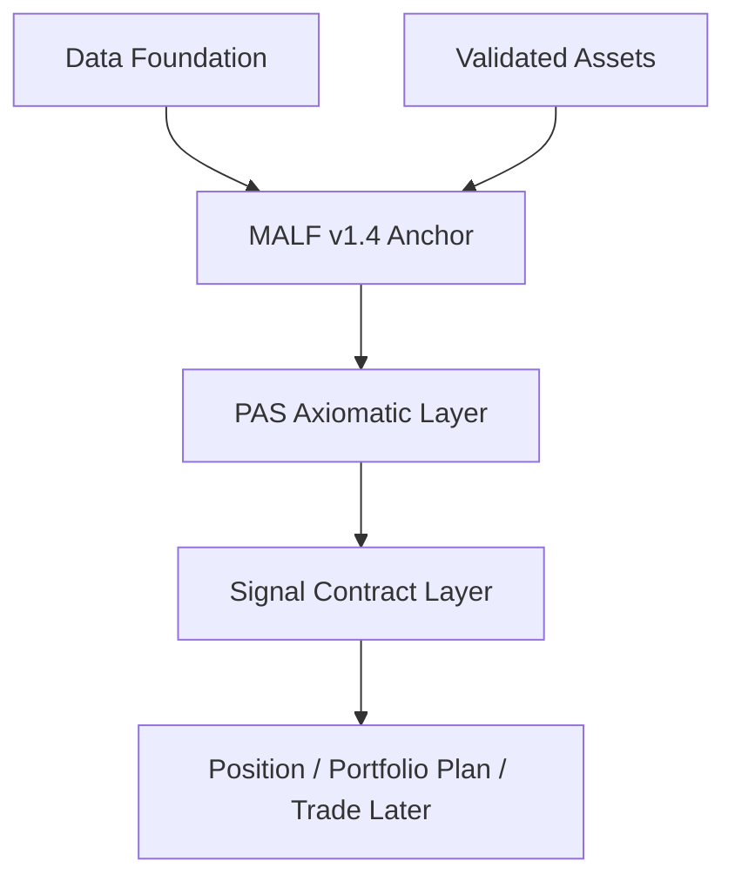

# MALF v1.4 锚点位置 v1

日期：2026-05-15

状态：frozen-by-malf-v1-4-immutability-anchor-card-20260515-01

## 1. 定位

`H:\Malf-Pas-Validated\MALF_Three_Part_Design_Set_v1_4` 是本系统当前长期 `authority_anchor`。
`H:\Malf-Pas-Validated\MALF_Three_Part_Design_Set_v1_4.zip` 是随当前 anchor 目录保留的
authority zip copy；正式可恢复 snapshot 归属 `H:\Malf-Pas-backup`。

`H:\Asteria-Validated\MALF_Three_Part_Design_Set_v1_4` 和
`H:\Asteria-Validated\MALF_Three_Part_Design_Set_v1_4.zip` 是 predecessor/original source
reference，用来证明来源、追溯和对照。

目录内 `MANIFEST.json` 是锚点包的文件清单、边界说明和禁止解释入口。

三者只能用于确认 MALF v1.4 的结构事实、WavePosition、transition、boundary 与操作边界。
它们不是本仓库 runtime、正式 DB、schema migration、下游施工或 broker proof 的授权来源。

## 2. 锚点裁决

| 规则 | 裁决 |
|---|---|
| MALF 是否继续演化 | v1.4 原目录不改写；第 13 卡已新建 v1.5 successor design set |
| MALF 是否可被 PAS 重写 | 否 |
| MALF 是否可被 Signal / Position / Trade 重写 | 否 |
| MALF 是否可被外部 adapter 定义 | 否 |
| MALF 是否授权 runtime build | 否，锚点存在不等于 runtime 授权 |
| MALF 是否授权正式 DB mutation | 否 |
| 历史 MALF 版本用途 | 仅作桥接、差异分析和经验回收 |

## 3. 系统位置



## 4. 必守不变量

| invariant_id | invariant |
|---|---|
| `MALF-V1-4-ANCHOR` | `H:\Malf-Pas-Validated\MALF_Three_Part_Design_Set_v1_4` 是当前唯一结构锚点 |
| `STRUCTURE-FIRST` | 所有机会解释必须建立在 MALF 结构事实上 |
| `NO-PAS-REWRITE` | PAS 不得重写 MALF 定义 |
| `NO-SIGNAL-REWRITE` | Signal 不得回写或重写 MALF 定义 |
| `NO-POSITION-TRADE-REWRITE` | Position、Portfolio Plan、Trade 不得回写或重写 MALF 定义 |
| `NO-AUTHORITY-BY-ADAPTER` | 外部 adapter 不得拥有 MALF 语义 |
| `ANCHOR-NOT-RUNTIME-AUTHORIZATION` | 锚点存在不等于 runtime、正式 DB 或 broker 授权 |
| `MANIFEST-IS-BOUNDARY-EVIDENCE` | `MANIFEST.json` 只证明 v1.4 包边界，不证明运行结果 |

## 5. 非目标

- 不冻结新的 MALF schema
- 不执行 MALF runtime proof
- 不讨论 week/month/full build
- 不把锚点文档误写成运行结论
- 不写入 `H:\Malf-Pas-data`
- 不把历史 repo schema、runner 或 DuckDB 表面迁入本仓库

## 6. 冻结入口

本卡的机器可读冻结入口为：

```text
governance/malf_v1_4_immutability_registry.toml
docs/04-execution/records/governance/009-malf-v1-4-immutability-anchor-card-20260515-01.conclusion.md
```

第 9 卡通过后，下一卡推进为：

```text
predecessor-strength-map-card
```

第 11 卡已在当前 authority surface 中进一步把 PAS v1.1 设计集锚定为：

```text
H:\Malf-Pas-Validated\PAS__Three_Part_Design_Set_v1_1
```

第 12 卡进一步裁决：如果 MALF 需要补足 PAS 强弱识别所需的结构行为事实，必须新建：

```text
H:\Malf-Pas-Validated\MALF_Three_Part_Design_Set_v1_5
```

第 13 卡已把该目录冻结为 successor authority definition，用于只读发布：

```text
WavePosition + wave_behavior_snapshot
```

v1.5 只能作为 successor design set；不得回写、覆盖或伪装成 v1.4 原锚点。

第 14 卡已继续把下游 PAS successor 冻结为：

```text
H:\Malf-Pas-Validated\PAS__Three_Part_Design_Set_v1_2
```

它只能消费：

```text
WavePosition + wave_behavior_snapshot
```

第 15 卡已继续把 companion 场景图谱冻结为：

```text
H:\Malf-Pas-Validated\MALF_PAS_Scenario_Atlas_v1_0
```

它只能用来解释：

```text
MALF v1.5 + PAS v1.2 frozen semantics
```

不得被解释成 runtime、formal backtest、broker 或 profit proof。
