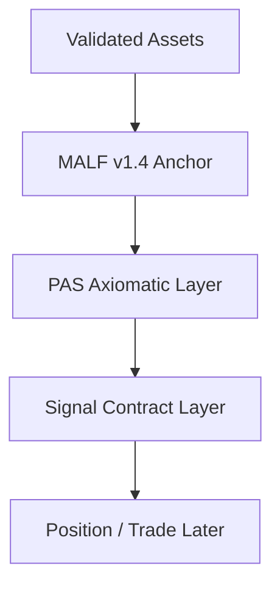

# MALF v1.4 锚点位置 v1

日期：2026-05-15

状态：active / immutable-anchor

## 1. 定位

`H:\Asteria-Validated\MALF_Three_Part_Design_Set_v1_4` 是本系统的长期 `authority_anchor`。

## 2. 锚点裁决

| 规则 | 裁决 |
|---|---|
| MALF 是否继续演化 | 本仓库第一阶段不演化 |
| MALF 是否可被 PAS 重写 | 否 |
| MALF 是否授权 runtime build | 否，锚点存在不等于 runtime 授权 |
| 历史 MALF 版本用途 | 仅作桥接、差异分析和经验回收 |

## 3. 系统位置

## 4. 必守不变量

| invariant_id | invariant |
|---|---|
| `MALF-V1-4-ANCHOR` | MALF v1.4 是唯一结构锚点 |
| `STRUCTURE-FIRST` | 所有机会解释必须建立在 MALF 结构事实上 |
| `NO-DOWNSTREAM-REWRITE` | 下游不得重写 MALF 定义 |
| `NO-AUTHORITY-BY-ADAPTER` | 外部 adapter 不得拥有 MALF 语义 |

## 5. 非目标

- 不冻结新的 MALF schema
- 不执行 MALF runtime proof
- 不讨论 week/month/full build
- 不把锚点文档误写成运行结论

