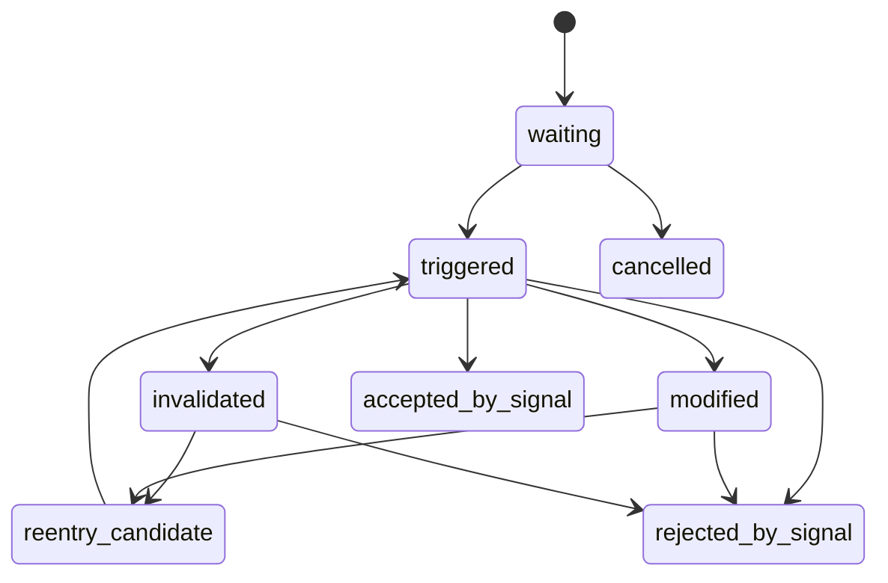

# PAS 公理化状态机 v1

日期：2026-05-15

状态：draft / governance-frozen-state-surface

## 1. 目标

本文件冻结 PAS 在治理阶段必须先拥有的最小状态机和语义层。

## 2. 系统定位

| 项 | 裁决 |
|---|---|
| PAS 角色 | `opportunity_interpreter` |
| 上游 | `MALF v1.4` |
| 下游 | `Signal` |
| 是否输出订单 | 否 |
| 是否输出仓位 | 否 |
| 是否输出成交 | 否 |

## 3. 七层语义

| layer | 作用 |
|---|---|
| `pas_market_context` | 解释当前处于什么结构与边界位置 |
| `pas_trigger_event` | 记录 setup 是否在当时触发 |
| `pas_strength_profile` | 基于已完成波段比较强弱与回撤质量 |
| `pas_in_flight_state` | 记录当前演进对预期的支持、削弱或失效 |
| `pas_candidate_lifecycle` | 记录候选等待、触发、取消、修改、重入、失效、接受、拒绝 |
| `pas_historical_rank_profile` | 记录同类 setup 的历史分位、样本量与稀疏性 |
| `pas_formal_candidate` | 供 Signal 消费的正式候选表面 |

## 4. 总状态流



## 5. 生命周期定义

| state | 含义 |
|---|---|
| `waiting` | setup 已形成，但尚未触发 |
| `triggered` | 当时可见事实下触发成立 |
| `cancelled` | setup 前提在触发前被破坏 |
| `modified` | 上下文改变，候选解释被修正 |
| `reentry_candidate` | 取消或失败后重新出现可审计机会 |
| `invalidated` | 当前结构事实使原候选失效 |
| `accepted_by_signal` | Signal 接受候选 |
| `rejected_by_signal` | Signal 拒绝候选 |

## 6. setup family

当前 PAS 继续使用五族入口，但只作为 setup family，不自动等于交易信号：

```text
TST
BOF
BPB
PB
CPB
```

## 7. YTC 第 5 章实例吸收口径

书中的实例在本系统中只吸收到 lifecycle 与 handoff 语义，不直接复制成交易动作：

| 实例语义 | PAS 吸收方式 |
|---|---|
| 触发前等待 | `waiting` |
| 触发成立 | `triggered` |
| 触发前取消 | `cancelled` |
| 条件变化后重判 | `modified` |
| 失败后重新形成机会 | `reentry_candidate` |
| 结构失效 | `invalidated` |
| 候选被正式放行 | `accepted_by_signal` |
| 候选被正式拒绝 | `rejected_by_signal` |

## 8. 明确 handoff 边界

以下内容属于后续 `Position / Trade`，不属于 PAS 输出动作：

- T1 / T2 分批
- 保本处理
- 跟踪止损
- 撤单与真实执行
- 收益统计与账户状态

## 9. 不变量

1. PAS 只能消费 MALF 已确认或当时可见的事实。
2. 当前进行中的波段只能进入 `pas_in_flight_state`，不能伪装成 completed baseline。
3. PAS 输出的是候选和理由，不是交易承诺。

