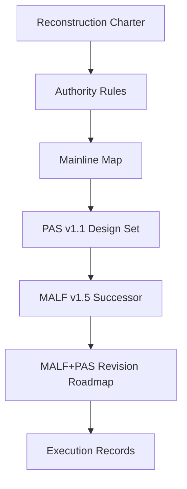

# Malf-Pas 文档入口

本目录是 `Malf-Pas` 的文档主入口。



## 文件分层

| 目录 | 职责 |
|---|---|
| `00-governance` | 重构总纲、来源裁决、执行纪律、repo 治理环境 bootstrap、根目录钢铁规则 |
| `01-architecture` | 主线权威图、MALF 锚点位置、旧系统强项地图、系统主线模块所有权、存储引擎与便携性裁决、历史大账本拓扑协议、每日增量与断点续传协议、回测窗口与留出样本协议 |
| `02-modules` | 模块设计标准、PAS 公理化定义与 MALF v1.5 successor 设计 |
| `03-roadmap` | 当前路线图与卡序列 |
| `04-execution` | 执行四件套、模板、结论索引 |

## 外部权威锚点

```text
H:\Malf-Pas-Validated\MALF_Three_Part_Design_Set_v1_4
H:\Malf-Pas-Validated\MALF_Three_Part_Design_Set_v1_5
H:\Malf-Pas-Validated\PAS__Three_Part_Design_Set_v1_1
H:\Asteria-Validated\MALF_Three_Part_Design_Set_v1_4 (predecessor/original reference)
```

当前定位：

```text
MALF defines structure facts.
PAS interprets opportunity.
PAS v1.1 starts from MALF WavePosition, identifies strength / weakness, rejects weakness, and joins strength.
MALF v1.5 is frozen to add wave_behavior_snapshot as MALF-owned structure behavior facts.
PAS v1.2 is planned to add strength_weakness_matrix from MALF outputs, without PriceBar reinterpretation.
MALF+PAS scenario atlas is planned for diagrams and sandbox cases, not alpha proof.
Signal decides candidate acceptance.
Data and System boundaries stay self-owned.
Storage switch requires independent proof.
Historical ledger topology is one logical ledger with governed sub-ledgers.
Daily incremental update is manifest-first, dirty-scope-bound, checkpointed, and audit-gated before promote.
Backtest windows are 2012..2021 coverage with 2012..2020 selection, 2021..2023 / 2024..2026 reserved holdout, and no holdout leakage.
Malf-Pas roots are split into repo / data / backup / validated / reprot / temp.
Book-origin brainstorming comes from G:\《股市浮沉二十载》.
Historical implementation tradeoff references come from G:\malf-history.
Current live next is pas-v1-2-strength-weakness-matrix-card.
```
