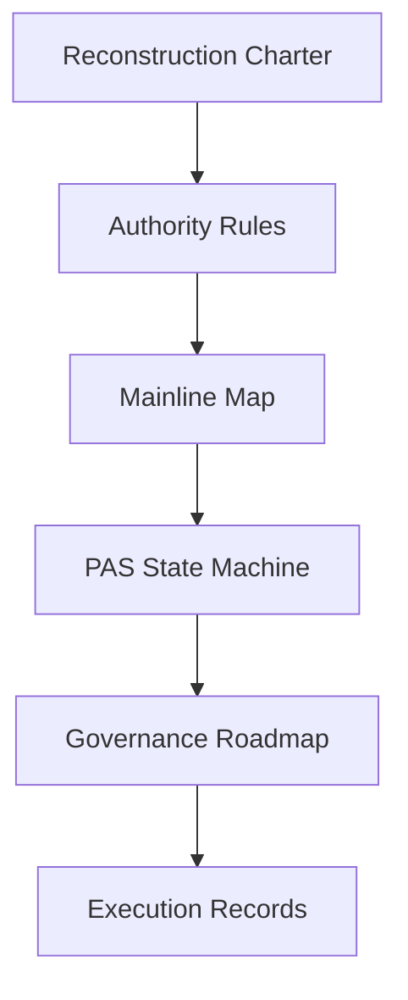

# Malf-Pas 文档入口

本目录是 `Malf-Pas` 的文档主入口。



## 文件分层

| 目录 | 职责 |
|---|---|
| `00-governance` | 重构总纲、来源裁决、执行纪律、repo 治理环境 bootstrap |
| `01-architecture` | 主线权威图、MALF 锚点位置、旧系统强项地图、系统主线模块所有权、存储引擎与便携性裁决、历史大账本拓扑协议、每日增量与断点续传协议 |
| `02-modules` | 模块设计标准与 PAS 公理化定义 |
| `03-roadmap` | 当前路线图与卡序列 |
| `04-execution` | 执行四件套、模板、结论索引 |

## 外部权威锚点

```text
H:\Asteria-Validated\MALF_Three_Part_Design_Set_v1_4
```

当前定位：

```text
MALF defines structure facts.
PAS interprets opportunity.
Signal decides candidate acceptance.
Data and System boundaries stay self-owned.
Storage switch requires independent proof.
Historical ledger topology is one logical ledger with governed sub-ledgers.
Daily incremental update is manifest-first, dirty-scope-bound, checkpointed, and audit-gated before promote.
```
